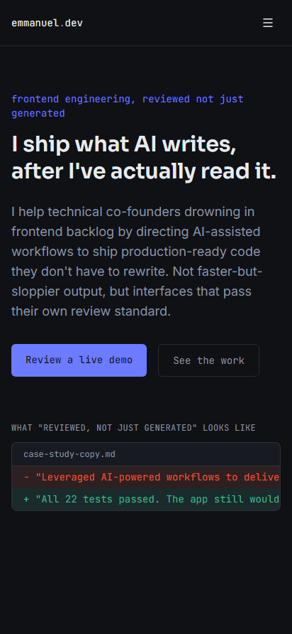
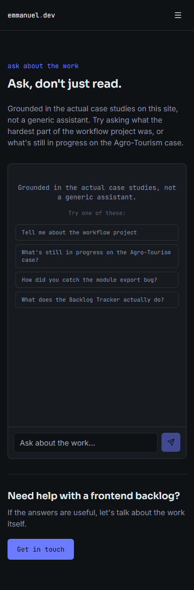
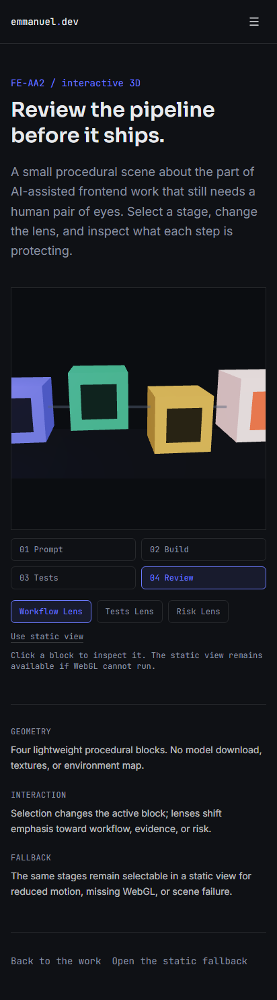
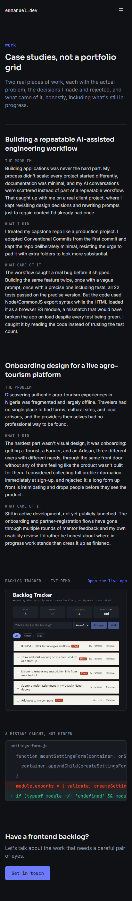
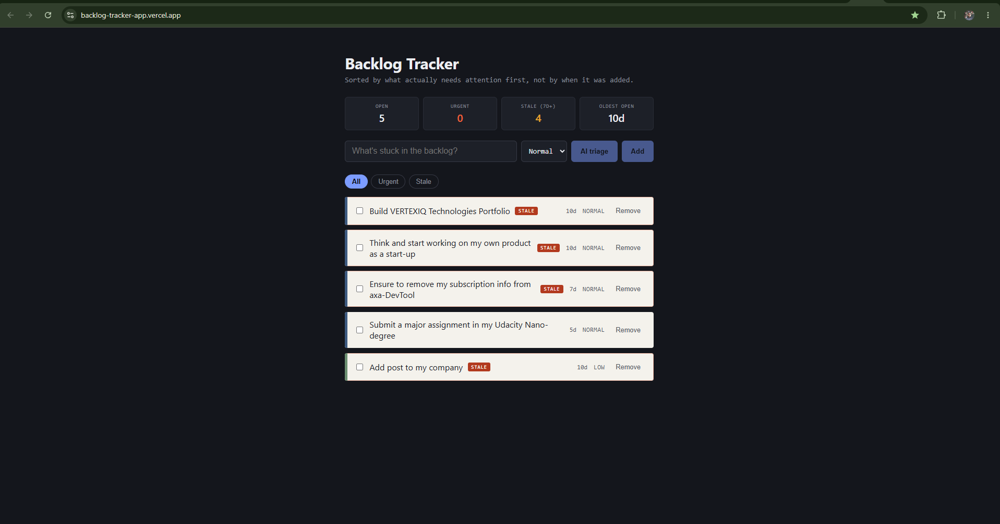

# Frontend AI Engineering Capstone

Production portfolio site for Emmanuel Chukwukere Obinna. The project demonstrates a reviewed AI-assisted frontend workflow through case studies, a grounded AI chat, an interactive review-pipeline experience, and a live product reference.

**Live production site:** [frontend-ai-capstone-two.vercel.app](https://frontend-ai-capstone-two.vercel.app/)

## Routes and features

- `/` - signature hero, proof statement, and reviewed-versus-generated case-study framing.
- `/chat` - streaming Gemini assistant grounded in the site's case studies, with loading, error, retry, and stop states.
- `/experience` - interactive React Three Fiber review pipeline with stage selection, workflow lenses, orbit controls, and a static fallback.
- `/work` - detailed case studies and a link to the deployed Backlog Tracker demo.
- `/about`, `/contact` - supporting portfolio information and contact route.
- `/health` - lightweight deployment health response.
- `/playground` and `/button` - isolated UI experiments.

## Screenshots

### Site pages






### Live product reference



## Tech stack

- Next.js 14 App Router, React 18, and TypeScript
- Tailwind CSS and local UI primitives
- Vercel deployment
- Vercel AI SDK with `@ai-sdk/google` and Gemini Flash Lite
- React Three Fiber, Drei, and Three.js for the review pipeline
- Vitest, React Testing Library, and Playwright

## Architecture

The App Router owns pages and the streaming endpoint at `app/api/chat/route.ts`. The chat configuration and grounded `getCaseStudy` tool live in `lib/`; the client chat UI is in `components/Chat.tsx`. The experience page dynamically loads the client-only 3D scene, while `StaticReviewPipeline` provides the accessible fallback. Shared navigation, controls, and case-study presentation remain componentized under `components/`. Static images and audit captures are kept in `public/` and `access-screenshots/`.

## Engineering and design decisions

- The assistant is constrained by a focused system prompt and must use `getCaseStudy` for project questions instead of inventing portfolio claims.
- The route streams responses, validates request shape and size, and keeps the Google credential on the server.
- Procedural 3D geometry avoids model and texture downloads. The scene is deferred, caps device pixel ratio at `1.5`, and has a static/reduced-motion fallback.
- The visual language uses a dark editorial canvas, monospaced labels, a display face, and restrained motion to support the reviewed-engineering theme.
- Accessibility work includes skip navigation, visible focus states, semantic controls, corrected chat announcements, and live WAVE verification. No speculative changes were made after the final audit.

## Environment variables

Copy `.env.example` to `.env.local` for local development. The placeholder file contains no credentials.

| Variable | Required | Used by | Description |
| --- | --- | --- | --- |
| `GOOGLE_GENERATIVE_AI_API_KEY` | Yes for real chat | Server route / Google provider | Google Generative AI credential. Keep it server-only; never prefix it with `NEXT_PUBLIC_`. |

Tests stub the chat request and do not require an AI credential. Do not commit `.env.local` or any real key.

## Local setup

Prerequisite: Node.js 18 or newer and npm.

```bash
git clone https://github.com/ephysians/frontend-ai-capstone.git
cd frontend-ai-capstone
npm install
cp .env.example .env.local
# Edit .env.local and set GOOGLE_GENERATIVE_AI_API_KEY for real chat requests.
npm run dev
```

On Windows PowerShell, use `Copy-Item .env.example .env.local` for the copy step. Open [http://localhost:3000](http://localhost:3000).

## Development and testing commands

```bash
npm run dev          # Start Next.js development server
npm run build        # Create a production build
npm run start        # Serve the production build
npm run typecheck    # Run TypeScript without emitting files
npm run lint         # Run Next.js ESLint checks
npm run test:unit    # Run Vitest component tests
npm run test:e2e     # Run Playwright browser tests
```

Playwright runs Chromium, Firefox, and WebKit projects. Install missing browser binaries with `npx playwright install` when needed. The E2E chat test intercepts `/api/chat`, so it is deterministic and does not call Gemini.

## Accessibility and performance

The final live WAVE audit reported zero errors, zero contrast errors, and zero alerts on `/`, `/chat`, and `/experience`; `/work` reported zero errors, zero contrast errors, and one alert. The recorded mobile Lighthouse results are documented in [AUDIT.md](AUDIT.md): performance scores were 69, 87, 70, and 87 for `/`, `/chat`, `/experience`, and `/work`, respectively. That file also records accessibility scores, FCP, LCP, TBT, CLS, methodology, and limitations. Results are samples and can vary with emulation, network, and CPU conditions.

## Production deployment

1. Import the repository into Vercel or run `vercel` from the repository root.
2. Set `GOOGLE_GENERATIVE_AI_API_KEY` in the Vercel project Environment Variables for the relevant deployment environments.
3. Deploy with the default Next.js build settings. Vercel runs `npm run build`.
4. Verify `/`, `/chat`, `/experience`, `/work`, and `/health` on the deployment URL.

The current production URL is [https://frontend-ai-capstone-two.vercel.app/](https://frontend-ai-capstone-two.vercel.app/). The chat route exports `maxDuration = 30` for the Vercel streaming function.

### Security and AI-route protection

- Requests are limited to 20 messages, 4,000 characters per message, and 12,000 characters total.
- A best-effort in-memory limiter allows 10 requests per client IP per 60 seconds and returns HTTP 429 with `Retry-After: 60` when exceeded.
- Malformed JSON, missing message arrays, invalid message parts, empty conversations, and oversized content are rejected before model invocation.
- The API key is consumed by the server-only Google provider and is absent from client bundles and `NEXT_PUBLIC_*` variables.
- The in-memory limit is appropriate for this small Vercel project but is instance-local in a serverless deployment. A shared edge/database limiter should replace it if the route becomes a public high-volume service.

## AI-assisted engineering

AI tools were used as an interactive implementation and review partner for the portfolio copy, UI components, chat flow, testing setup, accessibility audit follow-up, and deployment documentation. Prompts supplied the existing repository context and explicit constraints; generated suggestions were kept only when they matched the real case studies and project behavior. The work was validated with TypeScript, ESLint, Vitest, Playwright request fixtures, production builds, live WAVE scans, and recorded mobile Lighthouse runs. Secrets were kept out of prompts, source, and tracked environment examples.

## Browser validation

Playwright provides automated Chromium, Firefox, and WebKit coverage for the chat flow. WebKit is the closest automated check available for Safari; native Safari and mobile Safari still require manual validation on those platforms. The live accessibility results are recorded in `AUDIT.md` and the screenshot evidence is retained in `access-screenshots/`.

## Deployment and rollback notes

Vercel keeps each deployment available for inspection and rollback. Promote the last known-good deployment from the Vercel project dashboard when an immediate rollback is needed, then investigate and fix forward on a branch. For source-controlled changes, use a focused Conventional Commit and revert the offending commit rather than rewriting history. Never roll back by committing credentials or removing the audit artifacts.

## Repository standards

Use Conventional Commits (`feat`, `fix`, `docs`, `test`, `chore`, and similar), keep changes focused, and run the relevant type, lint, unit, E2E, and build checks before opening a pull request.

## License

Distributed under the MIT License. See [LICENSE](LICENSE).
